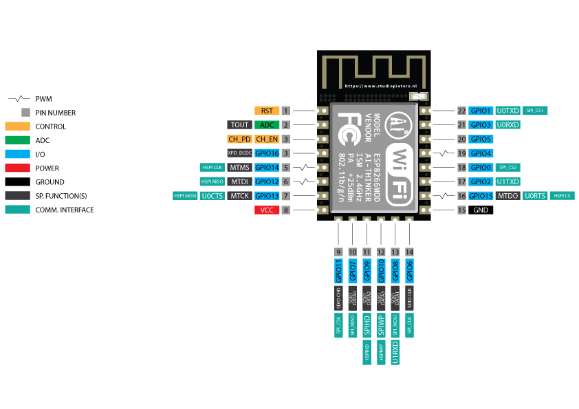

# Wi-Fi-deauther-with-ESP8266-OLED-module
wifi deauther with esp8266 oled module


<p align="center">
  
  
</p>

---



### 📟 OLED Display (SSD1306):
```go
- **GND** → GND on NodeMCU
- **VCC** → 3V3 on NodeMCU
- **SCL** → **D2** (GPIO 4)
- **SDA** → **D1** (GPIO 5)
```
---

### 🔘 Push Buttons:
- **UP Button**:
  ```go
  - One side to **D3** (GPIO 0)
  - Other side to **GND** (for pull-down)
  ```
- **OK Button**:
  ```go
  - One side to **SCLK (Labelled SK)** (GPIO 6)
  - Other side to **GND**
  ```
- **DOWN Button**:
  ```go
  - One side to **D5** (GPIO 14)
  - Other side to **GND**
  ```
---

### 🔌 Power:
- **Vin** → 5V (if you're powering from USB, already handled)
- **GND** → GND


</br>

---

### Run the `application` with `.bin file`

> Click to [download](https://github.com/akashdip2001/Wi-Fi-deauther-with-ESP8266-OLED-module/blob/main/public/02_updated_esp8266_deauther.ino.nodemcu.bin) the `.bin` file.

> just click the `row` button --> the file automaticely download to your system.

<p align="center">
  
  
</p>

---

## How many things you Do?

<p align="center">
  
  
</p>
<p align="center">
  
  
</p>

---

## update with [Hex](https://hexed.it/)


